Moodler
=======

Introduction
------------

Moodler is a software modular synthesiser for MacOSX. It consists of two
parts:

1.  A server. This generates audio signals that are played though the
    default audio device.
2.  A client. This sends commands to the server.

Audio is synthesised by modules that are connected using patch cables
from the outputs of one modules to the inputs of another module.

Figure 1. Some modules with connections

In Figure 1 we have three modules visible.

1.  On the left an "xor" module,
2.  in the middle a "bass drum" module,
3.  and on the right a "voltage comtrolled amplifier" module.

We also have blue and orange wires connecting these modules.

-   The blue wires carry control information. For example the wire from
    the "xor" module to the "bass drum" module is blue. It carries the
    signal saying when the drum should be triggered.
-   On the other hand, the output from the drum is attached to an orange
    cable. This is because it corresponds to an audio signal.

Note that in Moodler all signals are sampled at the same rate (typically
48kHz). Some Moodler modules input and output integers and those cables
have been coloured green.

The inputs to a module look like grey circles with a centre that
indicates the type of the input. The outputs from a module look like
black circles with a similar centre indicating type.

You can connect a cable by dragging from an output to an input. The
cable will be coloured according to the colour of the output.

You can drag a cable from its end (in an input) if you wish to plug it
in somewhere else. Or if you release a dragged cable away from any input
it will just vanish. You can drag multiple cables to a single input.
Only the last will be active with the previous cables being coloured
gray. The previous cable will become active again should you delete a
later cable. When I fix the bug, the 'c' key will rotate through the
cables attached to an input. This allows you to try a bunch of different
configurations in turn.

When you start the moodler UI you'll see two modules like those in
Figure 2

Figure 2. The modules present when the Moodler UI starts

The module on the left corresponds to MIDI input. That requires a
separate bridge application which will be described later. The module on
the right is the output module. You'll need to connect an audio signal
to it to hear anything.

Before running moodler you'll need to build it. Currently, in
`Moodler/MoodlerLib` you'll need to

`cabal install`

and in `Moodler/Moodler`

`cabal build make`

The installation of `Moodler` needs to be global until [hint issue
\#5](http://hub.darcs.net/jcpetruzza/hint/issue/5) is resolved. The
`make` will go away eventually. If these steps fail I'll have to leave
you to your Haskell-fu. For example you may need to install alex and
happy and mess with the dependencies.

To run Moodler go into `Moodler/Moodler` in two terminals. In one run
the server with

`cabal run moodler`

and in the other run the GUI with

`cabal run ui`

For a minimal example we'll listen to a voltage controlled oscillator
(VCO). We'll run a script to build a VCO. The scripts are in
`Moodler/Moodler/scripts` and we want the one called `vco`. Move the
cursor to the centre of the UI window and hit `alt-r`. Now type in the
script name `vco` and hit enter. You should end up with a view like in
Figure 3.

Figure 3. A VCO ready to be connected to output

Now drag from bottom right output of the VCO panel to the input on the
right.
(The output module now has three inputs corresponding to the left channel,
stereo to both channels, and the right channel. Use the centre one.)
You should hear a middle C played with a saw wave. Turn the
volume up if you hear nothing. You should see some confirmatory output
from the window running the `moodler` process. If you don't then
something is wrong.

Now you can start experimenting. Trying connecting different outputs
from the VCO to the output. Try dragging the "Tune" knob. If you select
the square wave output (the top right of the four bottom outputs) then
try dragging the "PWM" knob.

You can drag on any component to move it around. If you drag an input
that has no cables leading to it you'll find you can separate it from
the panel where it lives. In fact, you can use `alt-drag` to move any
component around. You can build your own modules by moving components
around. More of that later.

Moodler comes with some patches you can play with. Launch these with

`cabal run ui <patch-name>`

Some examples are

-   **test\_bits** A [one line
    symphony](http://countercomplex.blogspot.com/2011/10/algorithmic-symphonies-from-one-line-of.html)

-   **test\_tinkle** A metallic tinkling sound.

-   **test\_bounce** A ball bouncing on a membrane.

-   **test\_fanfare** A few notes from a well known piece of music.

-   **test\_arpeggio** A bunch of instruments playing a simple looped
    melody.

-   **test\_3dda** A "Euclidean" rhythm.

-   **test\_phaser** A sawtooth chord played through a phaser.

-   **test\_logistic** Uses the sample\_and\_hold module to set up the
    logistic equation modulating a filter.

-   **test\_logic** Uses logic gates to set up a simple rhythm.

Key commands
------------

The Moodler UI has a number of built-in key commands. Apart from those,
any script in `Moodler/Moodler/scripts` may be bound to a (possibly
modified) key.

Here are some built-in commands:

-   **alt-s** Save entire patch, i.e. everything currently on screen.
    When prompted for a name the final result is constructed by adding
    the extension `.hs` and saving in `Moodler/Moodler/saves`. The save
    format is in fact a Haskell script.

    Saving with the empty patch name uses the current project patch
    name.

    Note: If you save a patch with thousands of components and cables it
    can take a few seconds to reload because it needs to be compiled. At
    a future date I may implement an interpreter for the tiny subset of
    Haskell used in saves.

-   **alt-l** Load an entire patch. See **alt-s** for a description of
    how the file name is formed. As a side effect it also sets the
    current project patch name.

-   **alt-r** Run a script. The file name is constructed similarly to
    **alt-s** except that the script comes from
    `Moodler/Moodler/scripts/`.

-   **alt-w** Write a script. Saves a script corresponding to the
    currently selected components. The script will recreates any
    dependencies needed, for example the contents of planes linked to by
    proxies. (I haven't written plane/proxy docs yet.)

-   **alt-z** Undo last command. I need to sprinkle more checkpoints
    through the code to make this behave better.

-   **shift-alt-Z** Redo the last thing undone.

-   **"** Toggle `showhidden` mode. See [hide/unhide](#hide).

Here are some commands from the default `moodlerrc`:

-   **delete** Delete the currently selected component. If it's a
    container or proxy then the corresponding contents are also deleted.
    Note that nothing is ever really deleted on the server side but from
    the user's perspective this is hard to observe so don't worry about
    it.
-   **alt-h** Hide currently selected components. They still exist,
    they're simply not rendered. Useful when you want to build a module
    without making its internal parts visible. Hidden objects can be
    viewed in `showhidden` mode.

-   **shift-alt-H** Unhide currently selected components. Hidden objects
    can be selected for unhiding when in `showhidden` mode.

Components
----------

-   **Inputs**
-   **Outputs**
-   **Knobs**
-   **Containers**
-   **Proxies**

Modules
-------

Modules are built from primitives. Examples of primitives are sine wave
oscillators or addition operations. The primitives are defined by the
`.msl` files in `Moodler/Moodler/modules`. When `moodler` is launched it
automatically generates a module for each primitive in `scripts/`. These
are named after the primitive with an underscore prepended. Other
modules in `scripts/` were constructed non-automatically, sometimes by
writing Haskell code, sometimes by using **alt-w**.

Here are some modules:

-   **vco**

    

    Voltage controlled oscillator

    The vco module generates band-limited waveforms. It supports four
    types of output:

    1.  **Sine wave** Varies from -1 to 1.
    2.  **Square wave**

        This is the band-limited form of a square wave varying from -1
        to 1. This means it actually overshoots -1 and 1 slightly. This
        is correct behaviour. (See [Gibbs
        phenomenon](http://en.wikipedia.org/wiki/Gibbs_phenomenon).)

    3.  **Triangle wave**

        This is a band-limited triangle wave varying from 0 to 1.

    4.  **Saw wave**

        This is a band-limited saw wave varying from -1 to 1.

    The input controls are:

    -   **Tune** Sets frequency of output.
    -   **CV** Also sets frequency of output. This input is added to the
        value set by the "Tune" knob.
    -   **PWM** For square waves this sets the width of the pulse
        relative to the oscillation period.
    -   **Sync** Resets the phase of the output each time this input
        goes over zero. A reasonable attempt has been made to ensure
        this reset operation is band-limited for all four waveforms.
-   **lfo**
-   **\_vca**
-   **adsr**

Building a synthesiser
----------------------

Moodler is controlled by OSC commands.
If you plug a MIDI controller keyboard into your computer it sends MIDI
commands.
So you need a tool to convert MIDI commands to suitable OSC commands.
This is where the **bridge** tool is used.
Start moodler in a window with `cabal run moodler`.
In another run **bridge** with `cabal run bridge`.
And now run `cabal run ui`.

Now the outputs to the keyboard module in the UI are active.
A very simple way to use the keyboard is too hook up an oscillator.
So use **alt-r vco** to create a voltage-controlled oscillator and hook
it up.

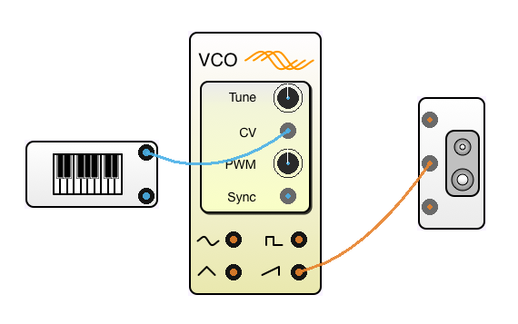

Now you can play. Unfortunately the last note played keeps sounding forever,
and when you start it's already playing a C note. We need a way to
make a note start sounding when a key is pressed and stop when it is released.
We can use the second 'trigger' output from the keyboard module to implement
this. It takes a value that is zero when no keys are pressed and non-zero
when a key is pressed. The non-zero value will correspond to the velocity with
which the key was pressed, or 1 if your keyboard isn't velocity sensitive.
So add a voltage-controlled amplifier with **alt-r _vca** and use the
velocity as the gain input.

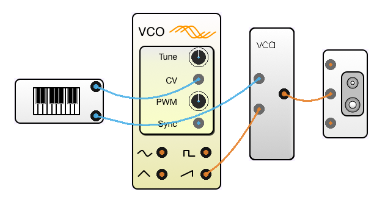

But you might want the note to keep sounding even after you've released the key.
For example you might want its sound to decay away slowly.
For this we need an envelope.
We can use the ADSR module for this.

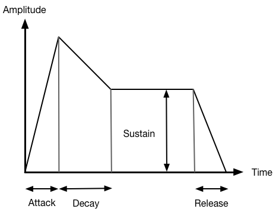

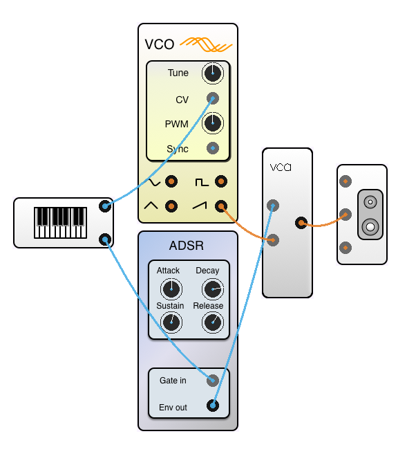

We can obtain other inputs from MIDI controllers.
Use the **bend** module to get the position of the pitch wheel.
Its output varies from -1 to 1.

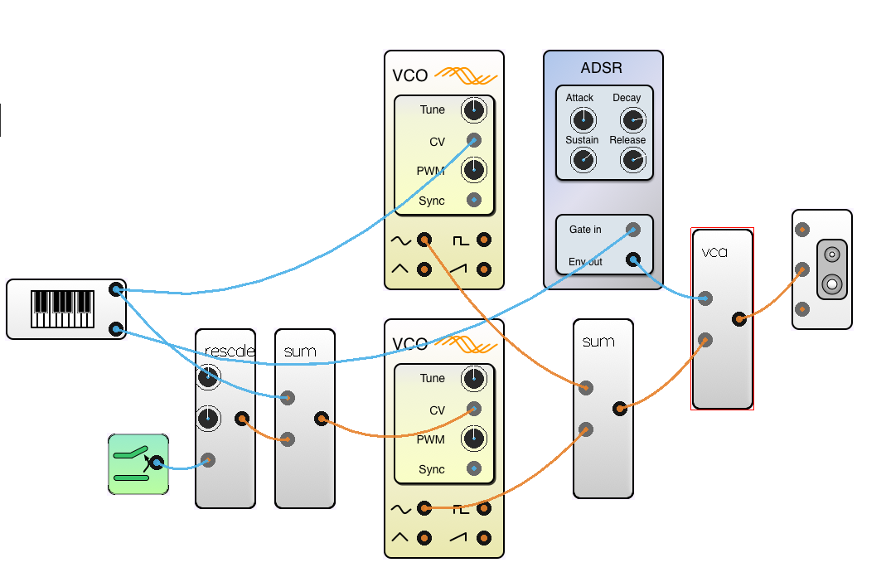

Building your own module
------------------------

There are quite a few approaches to building modules in Moodler. I think
this is the simplest. The VCA module essentially just multiplies its two
inputs together. Often you think of the first input as being the gain
and the second input as the signal being amplified. Let's build a
nonlinear voltage controlled amplifier that multiplies the signal by the
square of the CV input.

We can start by creating a VCA by using **alt-r** followed by **\_vca**:

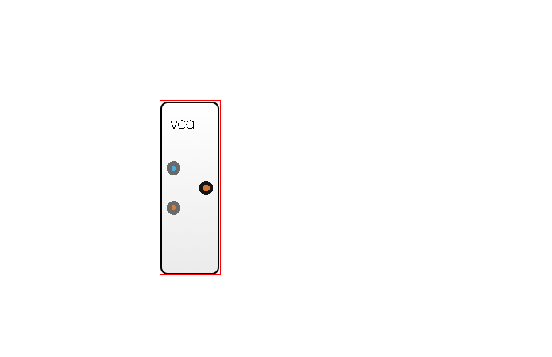\ 

Now make another VCA and direct the output of the first to the second:

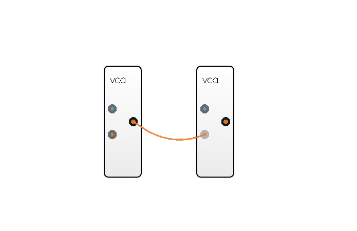\ 

Now we want to build the external plugs that cables will attach to. So
using **alt-r** we create suitable pairs of ins and outs using an
invocation of **audio\_warp** and two of **warp**. These each create
pairs of disembodied ins out outs that are magically connected even
though you can't see a cable. Hook these up as so:

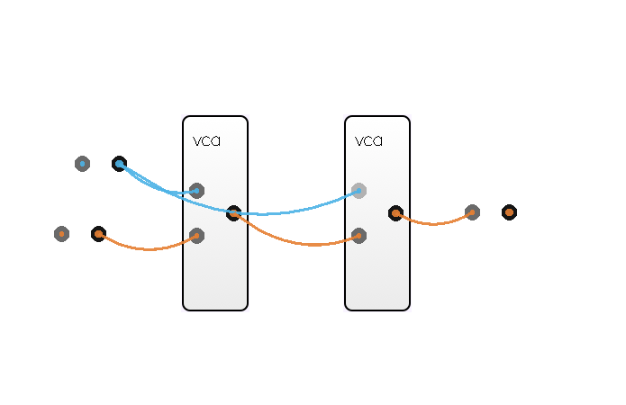\ 

The collection of components attached by cables to the VCAs will now go
inside a container. Select them with the mouse like so:

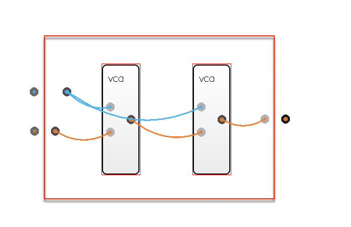\ 

Now hit **g** which places the selected components inside a new
container. Hit **esc** to get back out to the top level again. You'll
see the endpoints and an icon representing the container.

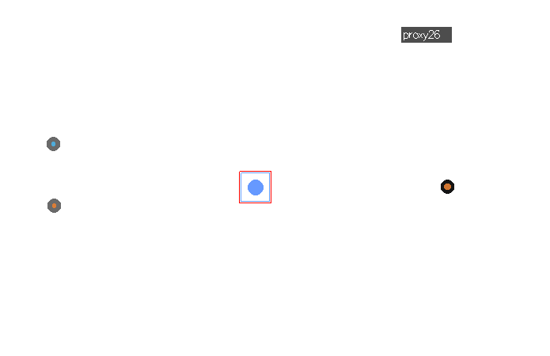\ 

Let's get rid of the ugly icon. Select the container and hit **\~** to
select the filename of a better looking image. I used
**panel\_bit\_and.png** but you can make your own image and store it in
the `assets/` directory.

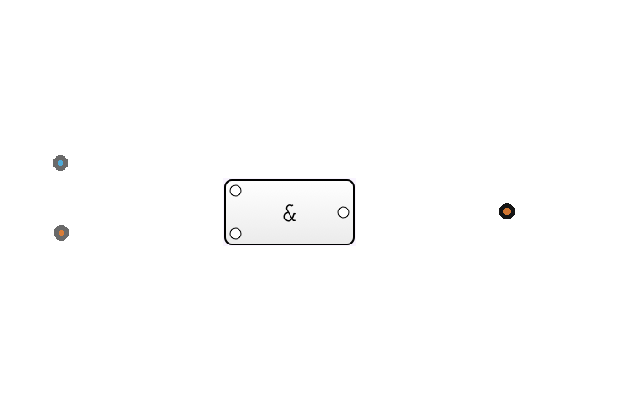\ 

Now **alt-drag** the ins and outs to their position on the container.

\ 

The ins and outs are correctly placed but they're not attached to the
container yet. With the mouse select the container (and the ins and
outs) and hit **p**. This attaches everything to the selected container.
There is an important concept here: the **g** command placed a set of
components *inside* a container, but **p** attached them on the
*outside*. Every container has an inside and outside like this. To look
inside a container **ctrl-click** on it. Use **esc** get back out again.

Once you have finished making your new component you can save it as a
script. Select the component and save it with **alt-w**. You can then
run your script again with **alt-r** and you'll get a copy. Note that
the script places the created object at the cursor relative to the
position of the cursor so when you save, place the cursor in the centre
of what you're saving.

You might want to attach a knob to the CV input at the top left. Select
it with a cursor and hit **k**. You can **alt-w** this too. **But!**
When you select components to **alt-w** you don't want to miss hidden
components. The script that **k** runs hides the original input. So hit
**"** before selecting and saving and hit it again afterwards to toggle
*showhidden* mode.

Some notes:

-   We used the `warp` and `audio_warp` to connect the inside of a
    container with the outside world without having to break a cable in
    two.
-   You can detach components from their container. In fact, the `warp`
    components are nothing other than an `id` module with the container
    removed.

Command line invocation
-----------------------

Glossary
--------

Issues
------

There are lots of bugs in moodler, most of which are of the "I haven't
had time to cover that case yet" variety. Some cause moodler to
terminate without saving. They include:

1.  Commands to set the value of a component that can't have its value
    set (eg. anything that isn't a knob) can cause termination.
2.  Any output can be connected to any input. The types are not checked
    in any way. Sometimes the result C code won't compile. (I haven't
    decided how to handle this yet. I don't want overly strict type
    checking as that might eliminate some creative uses of modules.
    Functional fixedness is antithetical to the modular synth
    philosophy.)
3.  This documentation is incomplete.
